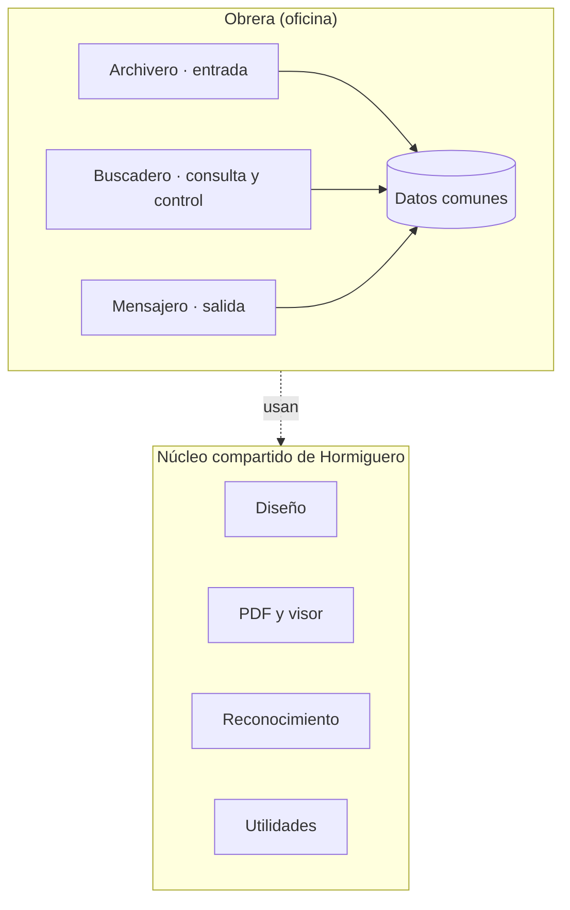

# Plan del ecosistema Hormiguero — orden de desarrollo e integración

**Estado:** nombres y agrupación decididos (D-21 a D-24). El orden de desarrollo lo definirá el procedimiento de MQD v2 (D-25).

## 1. Estructura

```
Hormiguero                 (ecosistema: toda la familia de software)
└── Obrera                 (ambiente de oficina)
    ├── Archivero          (entrada: lo que llega)
    ├── Buscadero          (consulta y control: lo que se tiene)
    └── Mensajero          (salida: lo que se envía o entrega)
```

Regla para ubicar cualquier función nueva: ¿el documento **entra**, se **consulta** o **sale**? Solo si no calza en ninguna nace una app nueva (D-21).

## 2. Qué absorbe cada app

| App | Rol | Absorbe del entorno antiguo |
|---|---|---|
| Archivero | Entrada | Archivero, Facturas JCV / ExtractorCobelcar (pasa a ser una configuración), impresión automática al archivar, carga e indexado de certificados |
| Buscadero | Consulta y control | Buscadero, visor, marcas, comparación, cadenas, dudosos, alertas y seguimiento (Motores), enlace certificado ↔ guía, "al facturar, con la OCC muéstrame cliente, NVV, guía y obra" |
| Mensajero | Salida | ClickFactura (correos de facturas desde la planilla del ERP), Ofisuiza (mensajes de retiro, copiar datos, mayúsculas), ayuda para pasar datos al ERP, herramientas de planillas Excel, pedido de certificados al proveedor |

El detalle de arreglos e ideas de cada una está en `PENDIENTES-FUNCIONALES.md`.

## 3. Orden de desarrollo (D-30, D-33)

Regla: primero lo que depende de menos piezas (o de ninguna), después lo que se apoya en lo ya construido.

| Nivel | Pieza | Usa |
|---|---|---|
| 0 | Diseño, Utilidades, Lectura de PDF, Datos comunes | nada |
| 1 | Visor | lectura de PDF, diseño |
| 1 | Reconocimiento | lectura de PDF, datos |
| 2 | Buscadero · apertura | visor, datos |
| 3 | Archivero · apertura | reconocimiento, utilidades, datos |
| 4 | Mensajero · apertura | reconocimiento, búsqueda de documentos |
| 5 | Seguimiento (dentro de Buscadero) | todo lo anterior |

- De cada pieza del núcleo se construye solo lo que pide la app de encima.
- Primero las aperturas (versión mínima usable de cada app, D-28); después cada app se completa en el mismo orden y parte su mes de uso (D-16, D-17).
- No se usan los .exe antiguos como puente (D-32): todas las funciones son urgentes (D-31).

## 4. Integración desde el principio (D-18)

- Un solo monorepo y una sola solución .NET: el código se comparte de verdad, no se copia.
- Núcleo compartido, construido solo a medida que una app lo necesita:
  - Diseño: tema, colores, controles y textos comunes de la familia Hormiguero.
  - PDF y visor: texto con coordenadas, páginas, marcas aparte del original.
  - Reconocimiento: zonas marcadas en un PDF de ejemplo → datos extraídos.
  - Utilidades: RUT, fechas y días hábiles, carpetas año/mes, mover archivos de forma segura, vigilancia de carpetas sin sobrecargar la red.
- Datos comunes (documentos, clientes y proveedores, plantillas): **mecanismo pendiente** (¿base SQLite compartida?), se decide con los libros y las referencias.
- Cada app funciona sola; si encuentra a las otras instaladas, aprovecha sus datos.


